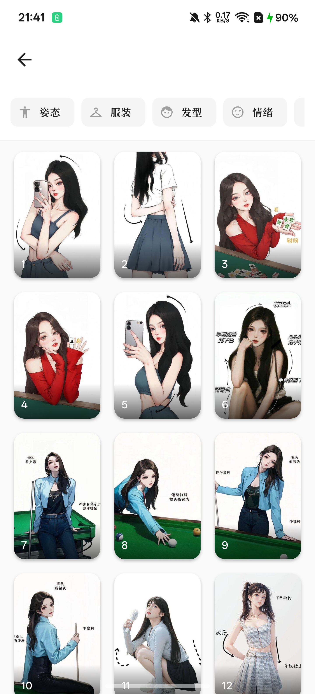

# Poze - 拍照姿势参考助手

<div align="center">
  
  
  <h3>专业的拍照姿势参考应用</h3>
  
  [](https://flutter.dev)
  [](https://dart.dev)
  [](LICENSE)
</div>

---

## 📱 应用简介

Poze 是一款专业的拍照姿势参考应用，帮助摄影师和模特快速找到合适的拍摄姿势灵感。通过独特的12位编码系统，用户可以精确筛选所需的姿势类型。

### ✨ 核心功能

- **🎯 12位编码筛选系统** - 按景别、构图、角度、姿态、动作、情绪、服装、发型、颜色、季节、场景、风格精确筛选
- **🔥 热门风格推荐** - 首页展示热门风格，快速浏览
- **📸 详情页交互** - 左右滑动切换姿势，底部Dock栏快速导航
- **❤️ 收藏管理** - 本地持久化存储，随时查看收藏
- **🤖 智能推荐** - 基于浏览历史的个性化推荐
- **📊 使用统计** - 数据分析页面，了解你的摄影偏好
- **✨ 流畅动画** - Hero过渡动画，图片预加载优化

---

## 🖼️ 应用截图

| 首页 | 浏览页 | 详情页 |
|:---:|:---:|:---:|
|  |  |  |

| 收藏页 | 统计页 | 筛选 |
|:---:|:---:|:---:|
|  |  |  |

---

## 🚀 快速开始

### 环境要求

- Flutter SDK 3.19.0 或更高版本
- Dart SDK 3.0.0 或更高版本
- Android Studio / VS Code
- Xcode (iOS开发)

### 安装步骤

```bash
# 克隆仓库
git clone https://github.com/your-username/poze.git
cd poze

# 安装依赖
flutter pub get

# 运行应用
flutter run
```

### 构建APK

```bash
# 构建Release版本
flutter build apk --release

# APK输出路径
# build/app/outputs/flutter-apk/app-release.apk
```

---

## 📁 项目结构

```
lib/
├── core/
│   ├── constants/          # 常量定义
│   │   └── app_constants.dart
│   └── theme/              # 主题配置
│       └── app_theme.dart
├── data/
│   ├── managers/           # 数据管理器
│   │   ├── asset_image_provider.dart
│   │   ├── favorites_manager.dart
│   │   ├── image_preloader.dart
│   │   ├── smart_recommendation_manager.dart
│   │   └── user_stats_manager.dart
│   ├── models/             # 数据模型
│   └── services/           # 服务层
├── presentation/
│   ├── pages/              # 页面
│   │   ├── home_page.dart
│   │   ├── browse_page.dart
│   │   ├── detail_page.dart
│   │   ├── favorites_page.dart
│   │   ├── stats_page.dart
│   │   └── ...
│   ├── providers/          # 状态管理
│   └── widgets/            # 公共组件
└── main.dart               # 应用入口
```

---

## 🔧 技术栈

| 技术 | 用途 |
|------|------|
| Flutter | 跨平台UI框架 |
| GoRouter | 路由管理 |
| Provider | 状态管理 |
| SharedPreferences | 本地存储 |
| 12位编码系统 | 姿势分类 |

---

## 📊 12位编码系统

每张姿势图片使用12位编码进行分类：

| 位数 | 特征 | 示例值 |
|------|------|--------|
| 1 | 景别 | 特写、近景、中景、全景、远景 |
| 2 | 构图 | 中心、三分、对称、对角线 |
| 3 | 角度 | 平视、俯拍、仰拍、侧拍 |
| 4 | 姿态 | 站姿、坐姿、蹲姿、卧姿 |
| 5 | 动作 | 静态、行走、跳跃、回眸 |
| 6 | 情绪 | 微笑、忧郁、自信、温柔 |
| 7 | 服装 | 长袖、短袖、连衣裙、外套 |
| 8 | 发型 | 长发、短发、盘发、马尾 |
| 9 | 颜色 | 暖色、冷色、明亮、柔和 |
| 10 | 季节 | 春、夏、秋、冬 |
| 11 | 场景 | 室内、街道、公园、海边 |
| 12 | 风格 | 前卫、复古、极简、优雅 |

---

## 🤝 贡献指南

欢迎提交 Issue 和 Pull Request！

1. Fork 本仓库
2. 创建特性分支 (`git checkout -b feature/AmazingFeature`)
3. 提交更改 (`git commit -m 'Add some AmazingFeature'`)
4. 推送到分支 (`git push origin feature/AmazingFeature`)
5. 提交 Pull Request

---

## 📄 许可证

本项目采用 MIT 许可证 - 详见 [LICENSE](LICENSE) 文件

---

## 🙏 致谢

- 感谢所有姿势图片的贡献者
- Flutter 团队提供的优秀框架
- 所有开源社区的贡献者

---

<div align="center">
  <p>如果这个项目对你有帮助，请给一个 ⭐️ Star！</p>
  
  <a href="https://github.com/your-username/poze/issues">报告问题</a>
  ·
  <a href="https://github.com/your-username/poze/discussions">讨论区</a>
</div>
